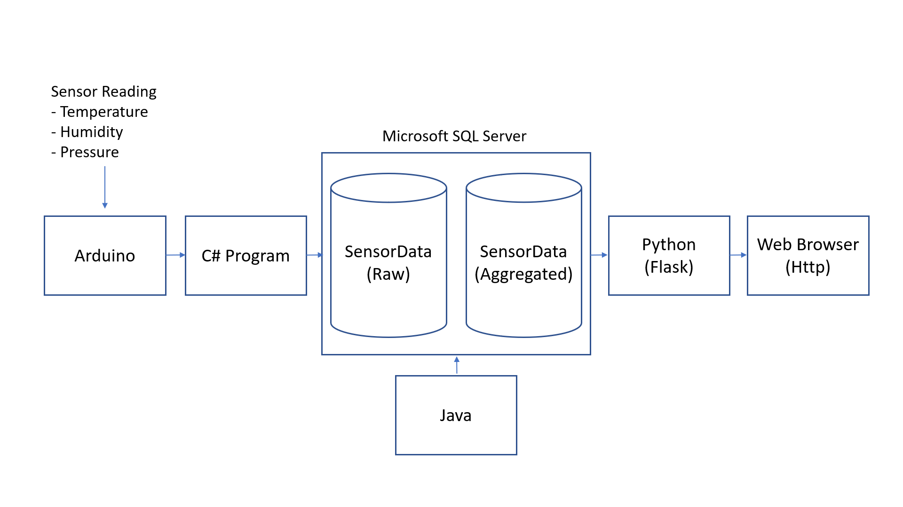

# Weather Station Project

A multi-layered system that collects sensor data from Arduino, stores raw sensor readings in a SQL Server database, computes daily aggregated statistics in another database, and provides a simple Python/Flask web interface to visualize both raw and aggregated data.

## Table of Contents

1. [Overview](#overview)
2. [System Architecture](#system-architecture)
3. [Technologies Used](#technologies-used)
4. [Setup & Installation](#setup--installation)
5. [How It Works](#how-it-works)
6. [Running the Project](#running-the-project)
7. [Project Structure](#project-structure)

---

## Overview

This project demonstrates a full data pipeline:

1. **Collect** data from sensors (e.g., temperature, humidity, pressure) via an Arduino.
2. **Store** raw sensor readings in `SensorDataDB` using a C# console app.
3. **Process** daily min, max, and average values using a Java program, which writes aggregated data into `sensorDataCalculated` (a second database).
4. **Visualize** both raw and aggregated data via a **Flask** web server written in Python.

---

## System Architecture

1. **Arduino**: Collects sensor readings and sends them over serial.
2. **C# Program**: Reads Arduino’s serial data, inserts raw records into `SensorDataDB`.
3. **Java Program**: Periodically calculates daily statistics (min, max, avg) from `SensorDataDB` and stores them in `sensorDataCalculated`.
4. **Flask (Python)**: Serves a web interface to display the data in two routes:
   * **`/raw`** for raw sensor data
   * **`/stats`** for aggregated stats

---

## Technologies Used

* **Arduino**: Sensor data collection.
* **C# (Console App)**: Inserts real-time sensor data into the database.
* **SQL Server**: Stores raw (`SensorDataDB`) and aggregated (`sensorDataCalculated`) data.
* **Java**: Performs daily calculations (min, max, avg).
* **Python + Flask**: Simple HTTP server and web interface to display the data.
* **pyodbc / ODBC**: Connect Python to SQL Server.
* **HTML/Jinja2**: Templating for the Flask web pages.

---

## Setup & Installation

1. **Arduino**
   * Install the [Arduino IDE](https://www.arduino.cc/en/software).
   * Upload the sketch that reads sensor data and prints them as comma-separated values to `Serial`.
2. **C#**
   * Use [Visual Studio](https://visualstudio.microsoft.com/downloads/) or [Visual Studio Code](https://code.visualstudio.com/) to build a console app.
   * Make sure you have **System.IO.Ports** (for serial) and **Microsoft.Data.SqlClient** / **System.Data.SqlClient** (for SQL Server).
3. **SQL Server**
   * Install SQL Server or use an existing instance.
   * Create two databases: **`SensorDataDB`** (for raw data) and **`sensorDataCalculated`** (for aggregated stats).
   * Ensure the tables (`SensorData`, `DailyStats`, etc.) match your code.
4. **Java (Daily Stats)**
   * Install [Java JDK](https://openjdk.org/).
   * Include the JDBC driver for SQL Server (`mssql-jdbc.jar`).
   * Run the Java code that calculates daily min, max, avg and inserts into `sensorDataCalculated`.
5. **Python + Flask**
   * Install Python 3, then run:

     - pip install flask pyodbc
   * Adjust your connection strings for each route (raw data vs. aggregated).

---

## How It Works

1. **Arduino**
   * Continuously prints sensor readings (e.g., `Temperature0,Humidity,Temperature1,Pressure`) to its serial port.
2. **C# Console App** (Serial to DB)
   * Opens the COM port.
   * Reads each line from Arduino.
   * Parses the sensor values and inserts them into `SensorDataDB..SensorData` table.
3. **Java Daily Stats**
   * Once per day (scheduled or manual), the Java program:
     * Fetches all records for that day from `SensorDataDB`.
     * Calculates min, max, and average for each sensor column.
     * Inserts a single row into `sensorDataCalculated..DailyStats`.
4. **Flask Web Server**
   * Has two routes:
     * **`/raw`**: Queries `SensorDataDB` for recent sensor rows and displays them.
     * **`/stats`**: Queries `sensorDataCalculated` for daily aggregated rows and displays them.

---

## Running the Project

1. **Start Arduino**

   * Make sure the Arduino is powered and sending data over the correct COM port.
2. **Run C# Serial App**

   * `dotnet run` or run the compiled executable.
   * Verify it inserts raw data into `SensorDataDB`.
3. **Run Java Aggregation**

   * `java -jar WeatherLog.jar` (for example).
   * This pulls data from `SensorDataDB` and writes to `sensorDataCalculated`.
4. **Run Flask App**

   - python app.py

   * Open your browser at [http://127.0.0.1:5000/]().
   * Visit `/raw` or `/stats` to see data.

---

## Project Structure

Example structure (adjust as needed):

WeatherStation/
├── Arduino/
│   └── WeatherStation.ino       # Arduino sketch
├── CSharpConsole/
│   └── Program.cs               # C# code that reads serial & inserts data
├── JavaAggregation/
│   └── WeatherLog.java          # Java code for daily min/max/avg calculations
├── PythonWeb/
│   ├── app.py                   # Flask server
│   ├── requirements.txt         # Python dependencies
│   └── templates/
│       ├── raw_data.html
│       └── stats_data.html
└── README.md
